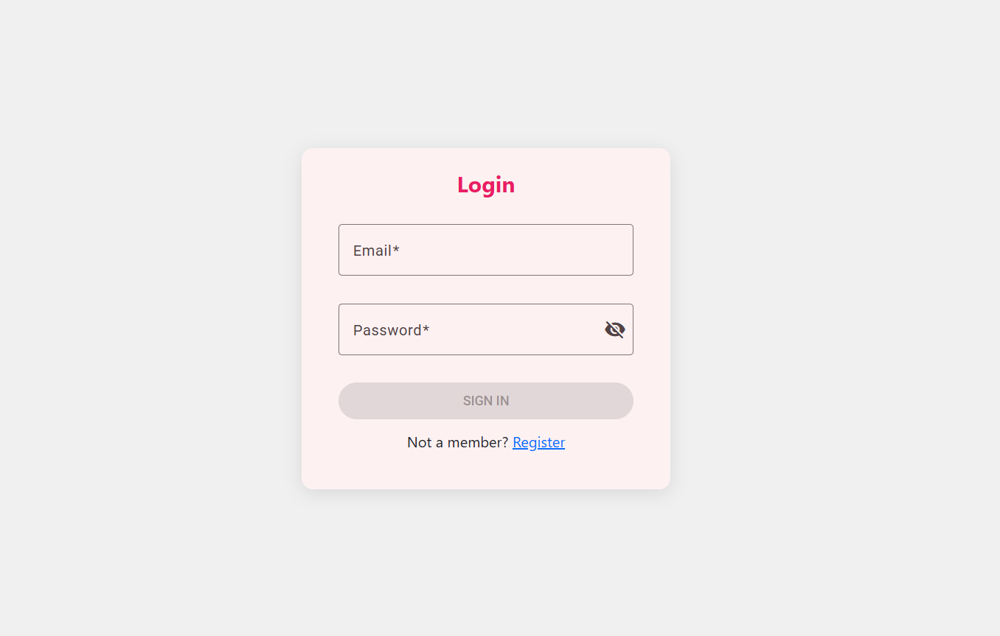
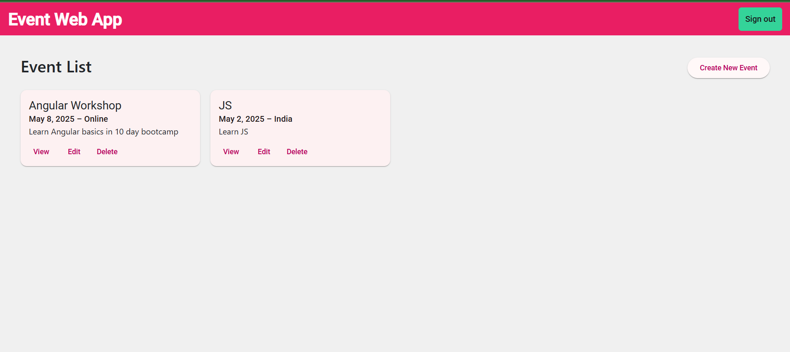
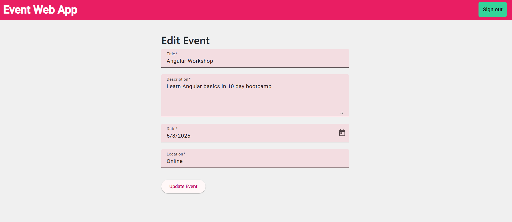
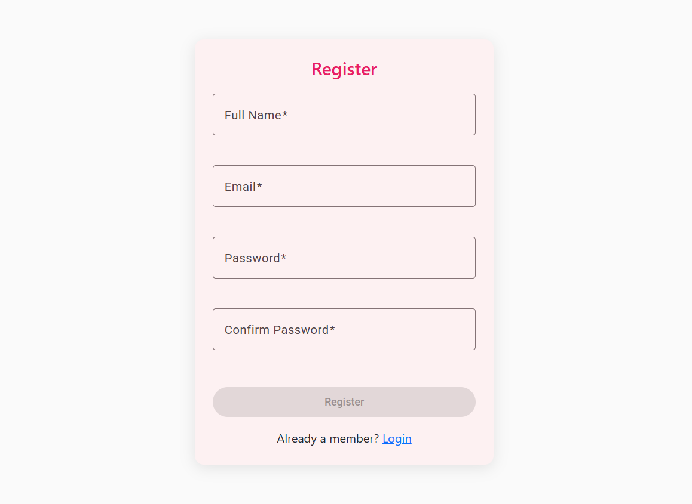
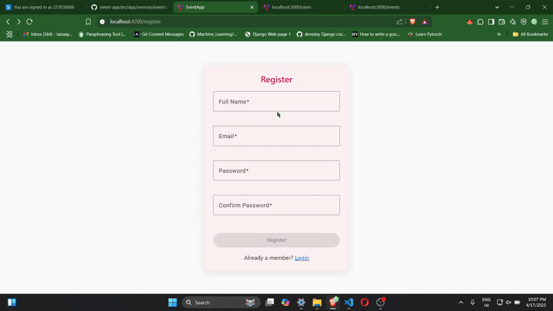

# Event Management Web App 🎉

A modern **Single Page Application (SPA)** for managing events, built with **Angular**, **Angular Material**, **RxJS**, and **JSON Server** as a mock backend. This app supports full CRUD operations for events, user authentication, and a responsive UI.

---

## 🚀 Features

- ✅ User authentication (login/register)
- 📅 Create, view, edit, and delete events
- 📱 Responsive layout using Angular Material
- 🔄 State management with RxJS
- 📂 Modular architecture with route-based lazy loading
- 📡 JSON Server for mock API backend

---


## 🖥️ Local Development

To start the app locally:

```bash
npm install
ng serve

json-server --watch db.json
```

Then open your browser and go to `http://localhost:4200/`.

---

## Project Structure

```
event-app/
├── src/
│   ├── app/
│   │   ├── components/         # Reusable UI components
│   │   │   ├── event-detail    # Detailed view of events
│   │   │   ├── event-list      # List view of events
│   │   │   ├── event-form      # Form to Add or Edit events
│   │   │   ├── home            # Home page
│   │   │   ├── login           # Login Page
│   │   │   └── register        # Registration Page
│   │   ├── gaurds/             # Protects pages from invalid access
│   │   ├── services/           # Angular services for API calls and state management
│   │   ├── shared/             # Shared modules, components, and utilities
│   │   ├── interfaces/         # TypeScript interfaces for type-checking
│   │   ├── app-routing.module.ts # Application routing configuration
│   │   └── app.module.ts       # Root module of the application
│   ├── index.html              # Main HTML file
│   ├── main.ts                 # Application entry point
│   └── styles.css              # Global CSS styles
├── public/
│   └── img/                    # Screenshots and public images
├── angular.json                # Angular CLI configuration
├── package.json                # Project dependencies and scripts
├── README.md                   # Project documentation
├── tsconfig.json               # TypeScript configuration
```

## 📸 Screenshots

| Login Page                           | Event List Page                        |
|-------------------------------------|----------------------------------------|
|  |  |

| Create/Edit Event Form              | Register Page                          |
|-------------------------------------|----------------------------------------|
|  |  |

---


## 🎥 Demo Video


## 📚 Resources

- [Angular](https://angular.io/)
- [Angular Material](https://material.angular.io/)
- [RxJS](https://rxjs.dev/)
- [JSON Server](https://github.com/typicode/json-server)

---
